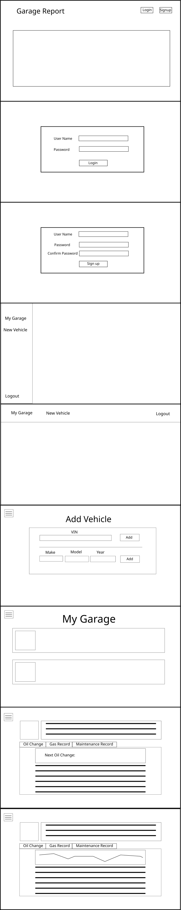

<h1 align="center">Garage Tracker</h1>


<h3 align="center"> Tracking the history of your car maintenance</h3>

<p align="center"> </p>
<p align="center"> </p>
<p align="center"> </p>

## Table of Contents
* [User Stories](#User-Stories)
* [Tools Used](#Tools-Used)
* [Installation](#Installation)
* [Project File Structure](#Project-Structure)
* [Project Wireframe](#Project-Wireframe)


Garage Tracker lets you keep track of all the work done on your vehicle. Search by VIN to get the most accurate information and add it to 
your garage. Keep track of each individual vehicles record with a quick and easy form system. 
### The Approach
I started with a wireframe of the site. This gave me a rough idea of how I wanted the site to look like and how the functionality would be presented to the user.
I knew I wanted to use Bootstrap, so I install that from the start. I created a new angular project and started with the navbar component.
I wanted to set up basic navigation for move around a little easier. Starting from the root I created the home component.
This was the simplest page because it's just the landing page. Next I created the vehicle search, and the garage components. I was having trouble with getting the 
search feature, so I moved on to the garage component. I took the data coming from the back end and use a ngFor to render the day for each object. After that I created the 
vehicle details page. I wanted everything to be in a single page, so I found a way to put the data in a tabbed format.
I seperated the components of oil change, gas fill, and maintenance record to make it easier to manage. During this whole process I kept working on trying to figure out the search issue.
After a few experiments I finally figured out the issue and was able to continue developing the application. I was able to get a rough working prototype of the site and 
after that I iterated, putting in more features and polish. 


### Unsolved Problems or Major Hurdles
One of the major hurdles was the search component. For a long time I couldn't figure out why it wasn't sending data to the variable. Later I found out some test html code was affecting the search bar.
Another issue I faced was with deployment. At the start the deployment was failing each time I tried. After a while of trying to deploy, just did a local build to see what was wrong. 
I found out that the application name did not match with what I had in the script file. After I changed that it started working. The current issue I'm having is 
with the home page carousel not animating correctly with node but working just fine with ng serve. 

### Todo
- [ ] Add user role to save data per user.
- [ ] Add login and signup
- [ ] Add security
- [ ] Add more integration and unit testing
- [ ] Add more styling
- [ ] Add resolver to all routes

## User Stories
- [x] As a user I would like to add vehicles
- [x] As a user I would like to log my oil changes
- [x] As a user I would like to log my gas fills
- [x] As a user I would like to log any maintenance done
- [x] As a user I would each record to be associated with a vehicle
- [x] As a user I would like a way to see all the records of a particular type
- [x] As a user I would like to add vehicle by VIN
- [ ] As a user I would like to create an account

## Tools Used

|                                                                        |            |
|:----------------------------------------------------------------------:|:----------:|
|                  |  Angular   |
|  |  VS Code   |
|               | TypeScript |
|    | Bootstrap  |
|                |  Inkscape  |
|                    |  Node.JS   |
|                   |   Heroku   |
|                 |    npm     |

Angular is the framework for the application. VS Code was the IDE that the application was created in. TypeScript is the scripting language that Angular uses. 
Bootstrap was use for styling, formatting, and animation. Inkscape was used for the creation of the wireframe. Node.js was used to build the final website, and it was deployed on Heroku.
Npm was used to install packages and dependencies to the project.

## Installation
- Install node and npm on your system, if you don't already have it. To check if you have them installed run `node --version` and `npm --version`
- While in the root directory, run `npm install` to install all dependencies for the application. 

This project was generated with [Angular CLI](https://github.com/angular/angular-cli) version 13.2.2.

### Development server

Run `ng serve` for a dev server. Navigate to `http://localhost:4200/`. The app will automatically reload if you change any of the source files.

### Code scaffolding

Run `ng generate component component-name` to generate a new component. You can also use `ng generate directive|pipe|service|class|guard|interface|enum|module`.

### Build

Run `ng build` to build the project. The build artifacts will be stored in the `dist/` directory.

### Running unit tests

Run `ng test` to execute the unit tests via [Karma](https://karma-runner.github.io).

### Running end-to-end tests

Run `ng e2e` to execute the end-to-end tests via a platform of your choice. To use this command, you need to first add a package that implements end-to-end testing capabilities.

### Further help

To get more help on the Angular CLI use `ng help` or go check out the [Angular CLI Overview and Command Reference](https://angular.io/cli) page.


## Project Structure

```text
├── package.json
├── package-lock.json
├── planning
│   ├── ERD.png
│   └── wireframe.png
├── README.md
├── server.js
├── src
│   ├── app
│   │   ├── app.component.html
│   │   ├── app.component.scss
│   │   ├── app.component.spec.ts
│   │   ├── app.component.ts
│   │   ├── app.module.ts
│   │   ├── app-routing.module.ts
│   │   ├── garage
│   │   │   ├── garage.component.html
│   │   │   ├── garage.component.scss
│   │   │   ├── garage.component.spec.ts
│   │   │   └── garage.component.ts
│   │   ├── garage.resolver.spec.ts
│   │   ├── garage.resolver.ts
│   │   ├── home
│   │   │   ├── home.component.html
│   │   │   ├── home.component.scss
│   │   │   ├── home.component.spec.ts
│   │   │   └── home.component.ts
│   │   ├── navbar
│   │   │   ├── navbar.component.html
│   │   │   ├── navbar.component.scss
│   │   │   ├── navbar.component.spec.ts
│   │   │   └── navbar.component.ts
│   │   ├── trackerapi.service.spec.ts
│   │   ├── trackerapi.service.ts
│   │   ├── vehicle-details
│   │   │   ├── customadapter.service.spec.ts
│   │   │   ├── customadapter.service.ts
│   │   │   ├── custom-date-parser.service.spec.ts
│   │   │   ├── custom-date-parser.service.ts
│   │   │   ├── gasfillform
│   │   │   │   ├── gasfillform.component.html
│   │   │   │   ├── gasfillform.component.scss
│   │   │   │   ├── gasfillform.component.spec.ts
│   │   │   │   └── gasfillform.component.ts
│   │   │   ├── maintenanceform
│   │   │   │   ├── maintenanceform.component.html
│   │   │   │   ├── maintenanceform.component.scss
│   │   │   │   ├── maintenanceform.component.spec.ts
│   │   │   │   └── maintenanceform.component.ts
│   │   │   ├── oilchangeform
│   │   │   │   ├── oilchangeform.component.html
│   │   │   │   ├── oilchangeform.component.scss
│   │   │   │   ├── oilchangeform.component.spec.ts
│   │   │   │   └── oilchangeform.component.ts
│   │   │   ├── vehicle-details.component.html
│   │   │   ├── vehicle-details.component.scss
│   │   │   ├── vehicle-details.component.spec.ts
│   │   │   └── vehicle-details.component.ts
│   │   └── vehicle-search
│   │       ├── search-toast
│   │       │   ├── search-toast.component.html
│   │       │   ├── search-toast.component.scss
│   │       │   ├── search-toast.component.spec.ts
│   │       │   └── search-toast.component.ts
│   │       ├── vehicle-search.component.html
│   │       ├── vehicle-search.component.scss
│   │       ├── vehicle-search.component.spec.ts
│   │       └── vehicle-search.component.ts
│   ├── assets
│   │   └── img
│   │       ├── add.png
│   │       ├── carlogo.png
│   │       ├── cars
│   │       │   ├── 2016-jaguar-f-type-s-coupe-angular-front.webp
│   │       │   ├── img_1.jpg
│   │       │   ├── img_1.png
│   │       │   ├── img_2.jpg
│   │       │   ├── img_2.webp
│   │       │   ├── img_3.jpg
│   │       │   ├── img_4.jpg
│   │       │   └── img_5.jpg
│   │       ├── Flat gray car icons vector.eps
│   │       ├── garage.png
│   │       ├── gas.png
│   │       ├── home.gif
│   │       ├── img1.jpg
│   │       ├── img2.jpg
│   │       ├── img3.jpg
│   │       ├── img4.jpg
│   │       ├── maintain.png
│   │       └── oil.png
│   ├── environments
│   │   ├── environment.prod.ts
│   │   └── environment.ts
│   ├── favicon.ico
│   ├── index.html
│   ├── main.ts
│   ├── polyfills.ts
│   ├── styles.scss
│   └── test.ts
├── tsconfig.app.json
├── tsconfig.json
└── tsconfig.spec.json

```
### Project Wireframe


