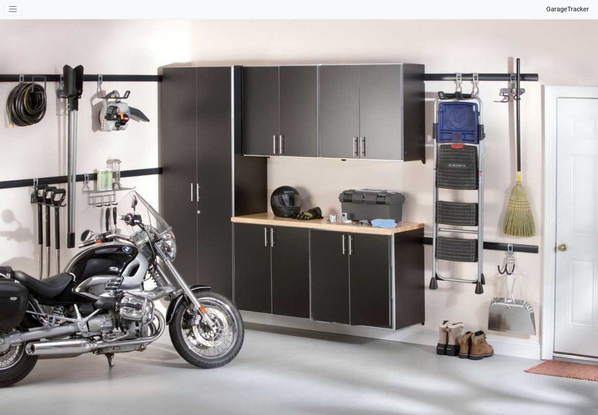
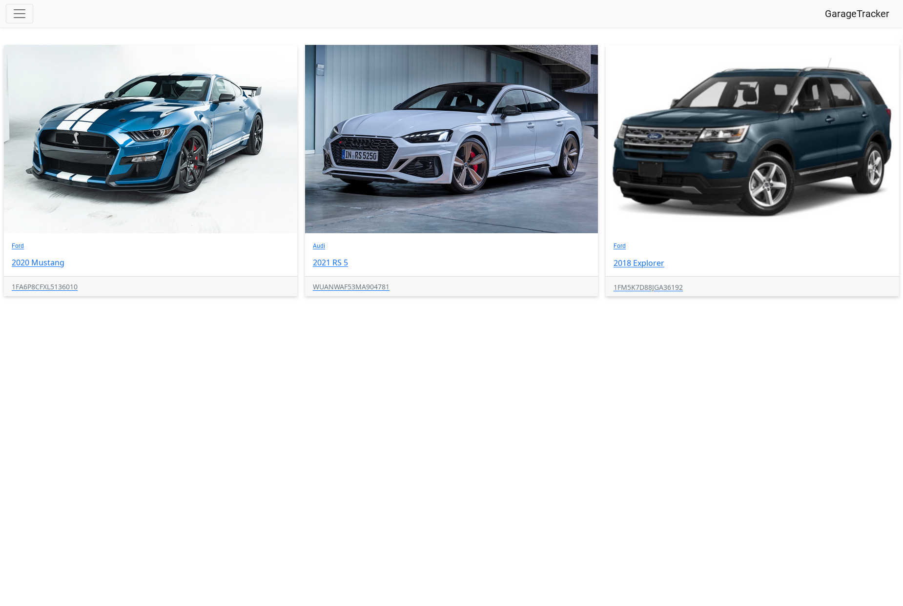
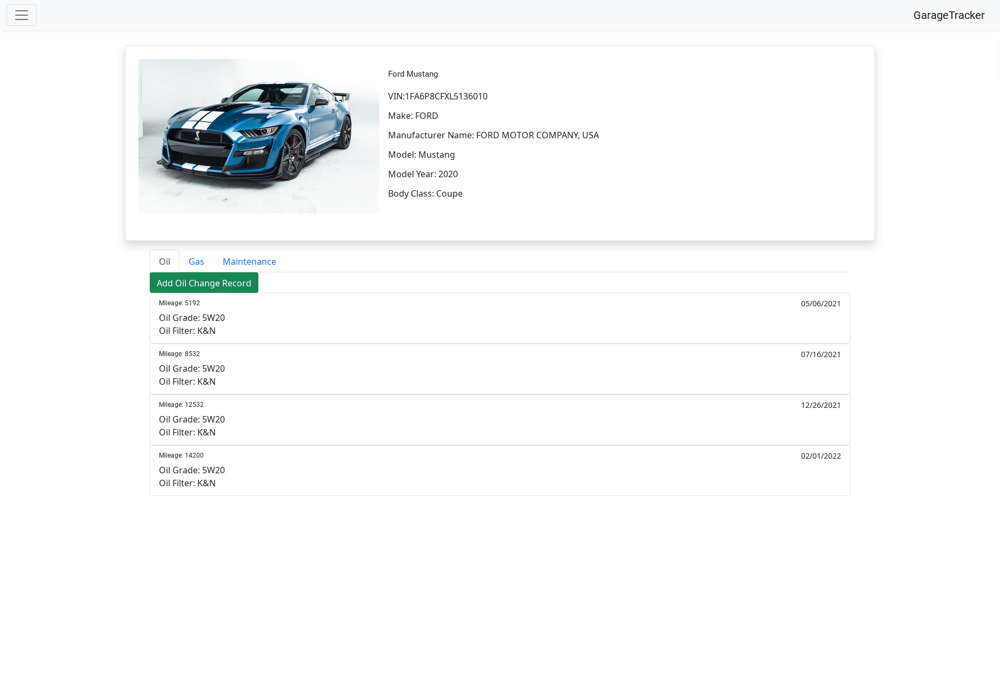

<h1 align="center">Garage Tracker</h1>

<h3 align="center"> Tracking the history of your car maintenance</h3>

 

 

 

## Table of Contents
* [User Stories](#User-Stories)
* [Tools Used](#Tools-Used)
* [Installation](#Installation)
* [POM Dependencies](#POM-Dependencies)
* [Entity Relationship Diagram (ERD)](#Entity-Relationship-Diagram)
* [Model View Controller System Design](#Model-View-Controller-System-Design)
* [API Endpoints](#Endpoints)
* [Database Layout](#Database-Layout)
* [Sample of Output](#Sample-of-Output)
* [Project File Structure](#Project-Structure)

### The Approach

### Unsolved Problems or Major Hurdles

### Todo
- [ ] Add user role to save data per user.
- [ ] Add login and signup
- [ ] Add security
- [ ] Add more integration and unit testing

## User Stories
- [x] As a user I would like to add vehicles
- [x] As a user I would like to log my oil changes
- [x] As a user I would like to log my gas fills
- [x] As a user I would like to log any maintenance done
- [x] As a user I would each record to be associated with a vehicle
- [x] As a user I would like a way to see all the records of a particular type
- [ ] As a user I would like to create an account

## Tools Used

|                                                                        |             |
|:----------------------------------------------------------------------:|:-----------:|
|                  |   Angular   |
|  |   VS Code   |
|               | TypeScript  |
|    |  Bootstrap  |
|       | PostgreSQL  |
|             |   Postman   |
|           |   Heroku    |
|         | Lucidcharts |

## Installation

This project was generated with [Angular CLI](https://github.com/angular/angular-cli) version 13.2.2.

## Development server

Run `ng serve` for a dev server. Navigate to `http://localhost:4200/`. The app will automatically reload if you change any of the source files.

## Code scaffolding

Run `ng generate component component-name` to generate a new component. You can also use `ng generate directive|pipe|service|class|guard|interface|enum|module`.

## Build

Run `ng build` to build the project. The build artifacts will be stored in the `dist/` directory.

## Running unit tests

Run `ng test` to execute the unit tests via [Karma](https://karma-runner.github.io).

## Running end-to-end tests

Run `ng e2e` to execute the end-to-end tests via a platform of your choice. To use this command, you need to first add a package that implements end-to-end testing capabilities.

## Further help

To get more help on the Angular CLI use `ng help` or go check out the [Angular CLI Overview and Command Reference](https://angular.io/cli) page.
